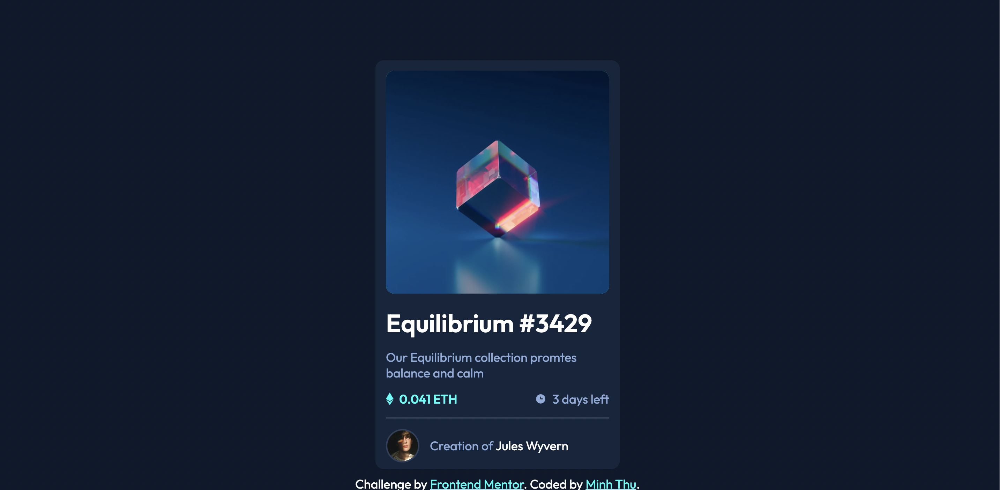

# Frontend Mentor - NFT preview card component solution

This is a solution to the [NFT preview card component challenge on Frontend Mentor](https://www.frontendmentor.io/challenges/nft-preview-card-component-SbdUL_w0U). Frontend Mentor challenges help you improve your coding skills by building realistic projects. 

## Table of contents

- [Overview](#overview)
  - [The challenge](#the-challenge)
  - [Screenshot](#screenshot)
- [Built with](#built-with)
- [Continued development](#continued-development)
- [Author](#author)
- [Acknowledgments](#acknowledgments)

## Overview

### The challenge

Users should be able to:

- View the optimal layout depending on their device's screen size
- See hover states for interactive elements

### Screenshot

## Built with

- HTML5
- CSS custom properties
- Flexbox

## Author

- Website - [Thu Nguyen](https://github.com/NgocMinhThuNguyen)
- Frontend Mentor - [@NgocMinhThuNguyen](https://www.frontendmentor.io/profile/NgocMinhThuNguyen)

## Feedback

I'd be happy to recieve any feesback on my work
Have a nice day!
Thank you!
